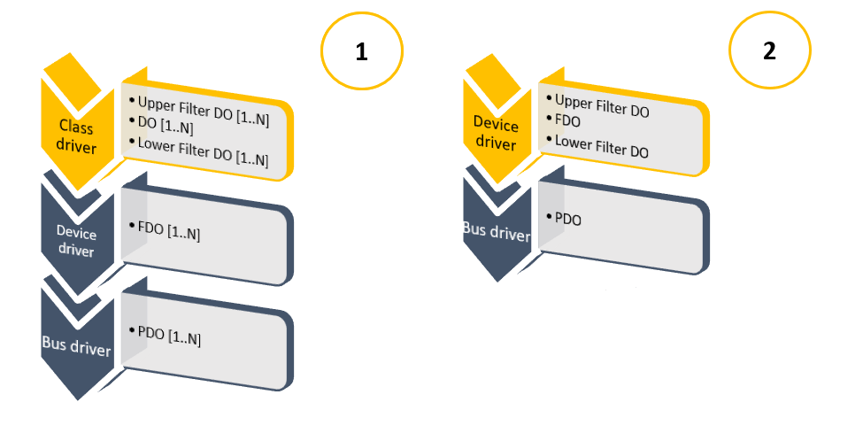

PCI Filter Driver
===

*This example is a concise introduction into filter driver development.
[Official documentation](https://learn.microsoft.com/en-us/windows-hardware/drivers/kernel/filter-drivers)
leaves several insights obscured.*

---

**A class driver** interacts with device drivers that implement different technologies. The upper 
edge, be it an application or a driver, has an unified representation.

Every PnP driver package specifies a *Class* in `.inf` setup. Windows allows development of 2
types of filter drivers:

1. *Class filter driver* placed above = `UpperFilters` or below = `LowerFilters` the class driver.
2. *Device filter driver* placed above or below the FDO of a target driver.



Installation is done either through an .inf file or through *registry + service control manager*
configuration.

---

*PCI class filter driver* is an observation post for base address registers raw and translated,
interrupts, memory range requirements. DMA channels or IO ports are not interpreted.

PCIe devices belong to a generic *SystemClass* for which there is no allocated driver. Devices
enumerated by UMBUS, CompositeBus, BasicRenderer, that have their `Class=System` in .inf package
are observed as well.

By adding the service to `LowerFilters` list, it is possible to trace IOCTLs generated by the FDO.
Several DOs call into ACPI, revealing the interaction between the OS or chipset vendor and the
platform.

Some `Parameters.DeviceIoControl.IoControlCode` are not found in the official headers. If the
*Custom* bit is reset, then the filter shows a stack trace. Since DispatchIoControls run in
parallel, the stack trace is protected by an output mutex. To reduce cluttering, identical stacks
are referenced by the hash of the 1<sup>st</sup> occurrence.

```.text
Call MJ_INTERNAL_DEVICE_CONTROL on 0xFFFFC006E64EAD50 @00:1F.7=ACPI\VEN_PNP&DEV_0C0B
Code 0x294244 undocumented on 0xFFFFC006E64EAD50 @00:1F.7=ACPI\VEN_PNP&DEV_0C0B
Stack 0xFFFFF8062F01A144
      0xFFFFF8062EF4D487
      0xFFFFF8062EEB7BF5
      0xFFFFF8062F44512B
      0xFFFFF8062EE66E35
Stack hash 0xEB0CB120
...
Call [MJ_PNP, QUERY_DEVICE_RELATIONS] on 0xFFFFC006E64EBD50 @00:1F.7=ACPI\VEN_PNP&DEV_0C0B for 
TargetDeviceRelation
Call MJ_INTERNAL_DEVICE_CONTROL on 0xFFFFC006E64EBD50 @00:1F.7=ACPI\VEN_PNP&DEV_0C0B
Code 0x294244 undocumented on 0xFFFFC006E64EBD50 @00:1F.7=ACPI\VEN_PNP&DEV_0C0B
      Encountered as hash 0xEB0CB120

nt!DbgBreakPointWithStatus:
fffff806`2f01f3b0 cc              int     3

.scriptrun DumpStackFrames.js

nt!KiStartSystemThread+0x34
nt!PspSystemThreadStartup+0x57
nt!ExpWorkerThread+0x155
nt!PopFanWorker+0x17b
nt!IofCallDriver+0x55
```

[DumpStackFrames.js](https://github.com/armaber/drivers/blob/main/PciFilter/DumpStackFrames.js)
decodes the stack pointers. Copy them to clipboard and `.scriptrun`.

---

Casting a narrow filter might be preferred. Unlike a class filter driver, a *device filter driver*
uses a crafted `.inf` file,  where the filter name is specified in the device's *HKR* hardware key.
This key is interpreted by the OS. The other 2 key types are:

- driver registry operating on driver scope
- device software registry interpreted by the FDO

The hardware key can be accessed without an .inf through *SetupAPI* calls.
[SetupFilter.ps1](https://github.com/armaber/drivers/blob/main/PciFilter/SetupFilter.ps1) handles both
installation and uninstallation of a filter. An .inf file provisions filter installation for devices
that are not plugged, ie *software first* installation, while the script acts on existing devices.

Using *SetupAPI* expedites deployment in production, where drivers must be certified. The .sys
image is signed once, while .inf package must be re-certified whenever *HardwareID* is modified.

Install the filter on a specific device with `.\SetupFilter.ps1 -DeviceId <Value>` where
*Value* is taken from Device Manager &#x2192; Properties &#x2192; Details &#x2192; `Device instance path`.
Omit `-DeviceId` switch to install it below the SystemClass.

---

`PciFilter.vcxproj` build target is x64. The project is generated with:

```powershell
$CerFile = "..\setup\testcertificate.cer";
if (-not (Test-Path $CerFile)) {
      $CerFile = $null;
}
$genArgs = @{
      Wdm = $true;
      Service = $true;
      CertificatePath = $CerFile;
      NtddiVersion = "NTDDI_WIN10_RS2";
}
& ..\build\GenerateVcxproj.ps1 PciFilter @genArgs;
```
Source code assumes device IOCTL processing at PASSIVE_LEVEL, following *ZwDeviceIoControl* model.
If new IOCTLs are discovered, besides those interpreted in 
[definitions.h](https://github.com/armaber/drivers/blob/main/PciFilter/definitions.h), then obtain
the human readable macro through [IoDecode.ps1](https://github.com/armaber/scripts/blob/main/DecodeIoctl/IoDecode.ps1).

The default stack frame size might limit the capture to a myriad of frames belonging to `Wdf01000.sys`
image. Increase as needed.

A filter driver can be developed in KMDF, with detours into WDM such as *EVT_WDFDEVICE_WDM_IRP_PREPROCESS*.
WDM is suitable for all refinements.

CodeQL coverage for `microsoft/windows-drivers:windows-driver-suites/mustfix.qls` rules passed.

- `windows-driver-suites/recommended.qls` reports are pedantic with false positives
   <details><summary>sarif results</summary>

   |Tool|Severity|Code|Description|Location|Line|
   |---|---|---|---|---|---|
   |CodeQL|warning|cpp/drivers/<br>illegal-field-access-2|The 'Type' field of the highestDO struct cannot be accessed by a driver.|river.c|83|
   |CodeQL|warning|cpp/drivers/<br>operand-assignment|An assignment has been made to an operand \[Flags\](1), which should only be odified using bit sets and clears.|driver.c|156|
   |CodeQL|warning|cpp/padding<br>byteinformationdisclosure|Memory allocation of \[_STACK_HASH_TRACE\](1) includes uninitialized adding bytes.|driver.c|585|
   |CodeQL|note|cpp/drivers/<br>wrong-dispatch-table-assignment|Dispatch table assignment should have a DRIVER_DISPATCH type outine as its right-hand side value.|driver.c|53|
   </details>